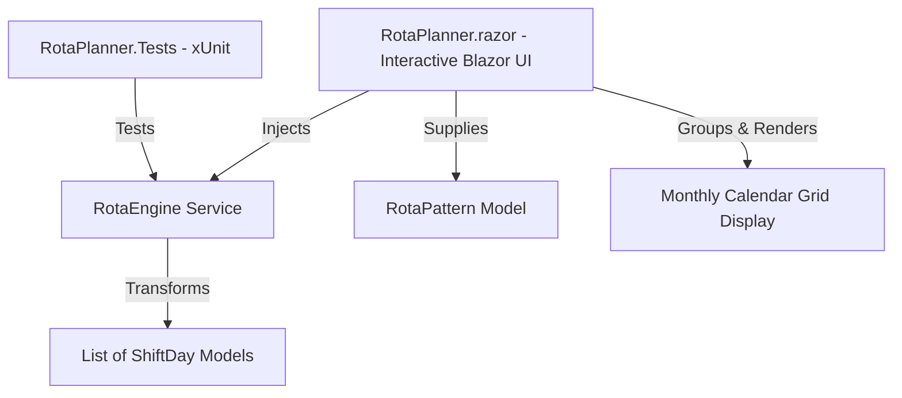

# Team Rota Planner

A modern, responsive **Blazor Server** application built with **.NET 10** and **C# 13** for designing, generating, and visualizing complex team shift rotas and repeating work schedules across multi-month calendar views.

---

## Table of Contents

- [Overview](#overview)
- [Key Features](#key-features)
- [Architecture & Design](#architecture--design)
- [Core Implementation](#core-implementation)
  - [Domain Models](#domain-models)
  - [Rota Generation Algorithm (`RotaEngine`)](#rota-generation-algorithm-rotaengine)
  - [Interactive UI Layer](#interactive-ui-layer)
- [Project Structure](#project-structure)
- [Getting Started](#getting-started)
  - [Prerequisites](#prerequisites)
  - [Build and Run](#build-and-run)
  - [Running Unit Tests](#running-unit-tests)
- [Design Principles & Rules](#design-principles--rules)

---

## Overview

Shift planning often involves non-standard repeating cycles (such as *4 days on, 2 days off, 5 days on, 2 days off*) coupled with rotating shift start hours. 

**Team Rota Planner** solves this by providing:
1. An independent, deterministic **schedule generation engine**.
2. An interactive **Blazor Server UI** with live preview and multi-month calendar visualization.

---

## Key Features

- **Dynamic Pattern Builder**: Configure custom shift cycles with arbitrary blocks of working and off days.
- **Alternating Shift Start Times**: Optionally rotate shift start times (e.g., 07:00, 08:00, 09:00 for 9-hour shifts) that cycle **strictly across working days** (off days do not consume shift start slots).
- **Multi-Month Calendar Grid**: View schedules from 1 up to 12 months ahead, formatted into Monday-first monthly calendar grids with color-coded status badges.
- **Instant Reactive Updates**: Modifying start dates, sequence steps, time rotation, or display duration automatically recalculates and refreshes the calendar grid in real time.
- **Unit Tested Core Engine**: Verified with automated xUnit tests covering multi-week cycles, edge cases, and time pool progression.

---

## Architecture & Design

The solution follows a clean separation of concerns:



- **Domain / Models (`RotaPlanner.Models`)**: Plain C# records and classes using modern types (`DateOnly`, `TimeOnly`).
- **Engine / Services (`RotaPlanner.Services`)**: Pure, stateless scheduling logic with zero dependency on UI or ASP.NET web types.
- **Presentation / Components (`RotaPlanner.Components`)**: Interactive Server-side Blazor components handling parameter controls, date grouping, and responsive CSS grid rendering.

---

## Core Implementation

### Domain Models

- **[`RotaPattern`](file:///Users/leo/repos/coolApps/RotaPlanner/Models/RotaPattern.cs)**:
  - `Sequence`: List of integers where positive numbers indicate consecutive working days and negative numbers indicate consecutive off days (e.g., `[4, -2, 5, -2]`).
  - `StartTimesPool`: List of integer hours (e.g., `[7, 8, 9]`) cycled through sequentially on work days.
- **[`ShiftDay`](file:///Users/leo/repos/coolApps/RotaPlanner/Models/ShiftDay.cs)**:
  - `Date`: `DateOnly` representing the specific calendar day.
  - `IsWorkDay`: `bool` indicating whether the day is active work or off.
  - `StartTime`: `TimeOnly?` containing the assigned shift start time (null on off days).

### Rota Generation Algorithm ([`RotaEngine`](file:///Users/leo/repos/coolApps/RotaPlanner/Services/RotaEngine.cs))

The engine executes in $O(N)$ time where $N$ is the number of calendar days to generate:

1. **Cycle Flattening**: Flattens `RotaPattern.Sequence` into a repeating boolean timeline representing a single full cycle. For example, `[4, -2]` expands to `[true, true, true, true, false, false]`.
2. **Timeline Iteration**: Iterates from `startDate` through `daysToGenerate`.
3. **Shift Time Cycling**: On days where `IsWorkDay == true`, the engine selects `pattern.StartTimesPool[timeIndex % pool.Count]` and increments `timeIndex`. Off days leave `timeIndex` intact so the rotation sequence is preserved across rest periods.

```csharp
public List<ShiftDay> GenerateSchedule(DateOnly startDate, RotaPattern pattern, int daysToGenerate)
```

### Interactive UI Layer ([`RotaPlanner.razor`](file:///Users/leo/repos/coolApps/RotaPlanner/Components/Pages/RotaPlanner.razor))

- **Monday-aligned Calendar Grid**: Calculates padding offsets using `((int)firstDayOfMonth.DayOfWeek + 6) % 7` to align the grid to Monday–Sunday.
- **Grouping**: Groups flat `ShiftDay` timelines into `MonthKey(Year, Month)` dictionaries for multi-month container rendering.
- **Shift Span Formatting**: Calculates 9-hour operational windows from start times (e.g., `07:00` renders as `07 to 16`).

---

## Project Structure

```text
RotaPlanner/
├── Components/
│   ├── App.razor                      # Root Blazor component & HTML shell
│   ├── Routes.razor                   # Blazor routing configuration
│   ├── Layout/
│   │   ├── MainLayout.razor           # Application layout and top navbar
│   │   └── ReconnectModal.razor       # Circuit reconnect handling UI
│   └── Pages/
│       ├── RotaPlanner.razor          # Main interactive planner page & calendar grid
│       ├── Error.razor                # Error display page
│       └── NotFound.razor             # 404 handler
├── Models/
│   ├── RotaPattern.cs                 # Sequence & shift timing model
│   └── ShiftDay.cs                    # Single day schedule model
├── Services/
│   └── RotaEngine.cs                  # Schedule generation algorithm
├── Properties/
│   └── launchSettings.json            # Local dev server profiles
├── RotaPlanner.Tests/
│   ├── RotaEngineTests.cs             # xUnit test suite for RotaEngine
│   └── RotaPlanner.Tests.csproj       # Test project file
├── Program.cs                         # Application entrypoint & DI setup
├── RotaPlanner.csproj                 # Web project file (.NET 10)
└── GEMINI.md                          # Project development instructions & conventions
```

---

## Getting Started

### Prerequisites

- [.NET 10.0 SDK](https://dotnet.microsoft.com/download) (or compatible .NET SDK)

### Build and Run

1. Navigate to the project directory:
   ```bash
   cd RotaPlanner
   ```

2. Restore dependencies and run the web application:
   ```bash
   dotnet run
   ```
   Or run with hot reload during development:
   ```bash
   dotnet watch
   ```

3. Open your browser and navigate to the URL shown in the terminal (typically `https://localhost:5001` or `http://localhost:5000`).

### Running Unit Tests

Execute the xUnit test suite with:

```bash
dotnet test
```

---

## Design Principles & Conventions

- **Engine Independence**: The `RotaEngine` is kept completely decoupled from web/UI abstractions for maximum testability and reusability.
- **Modern .NET Date Types**: Calendar dates strictly use `DateOnly`, and shift start times strictly use `TimeOnly`.
- **Explicit Typing**: Explicit type declarations are preferred over `var` where they improve clarity for AI and human readability.
